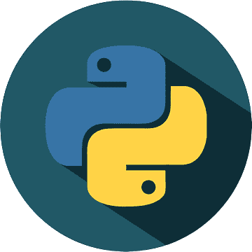
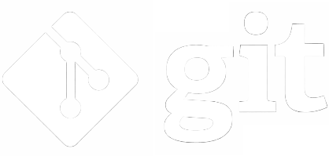
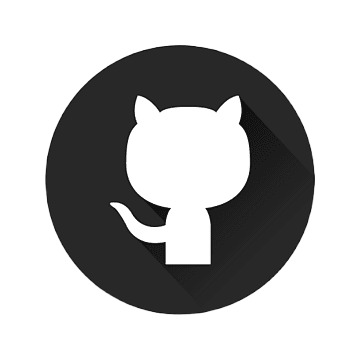

# Arijit

 
Hello, my name is <strong>Arijit</strong>, and I'm a student and programmer with a passion 
for technology and productivity. I thoroughly enjoy learning about computers
and programming languages. My programming journey started with <strong>C</strong>, 
and then I moved on to <strong>JAVA</strong> to learn about Object-Oriented Programming. 
After gaining a strong foundation in OOP concepts, 
I chose <strong>Python</strong> as my preferred language for its ease of use and versatility.

Currently, I am mostly focused on <strong>Django</strong> for web development, 
while also actively learning <strong>JavaScript</strong> to enhance my skills. 
Although my focus is primarily on preparing for my GATE-2024 exam, 
I plan to return to development after 2024. 
I'm excited to apply my skills and knowledge 
to building exciting projects in the future.

  👨‍💻 <strong>Skills:</strong> C, C++, Java, Python, Django.

  💼 <strong>Tools:</strong> Visual Studio Code, JetBrains IDE, Git, GitHub.

  💌 If you want to collaborate with me (or have a small talk), feel free to mail me at
<a href="mailto:arijitchabri2001@gmail.com">arijitchabri2001@gmail.com</a>

